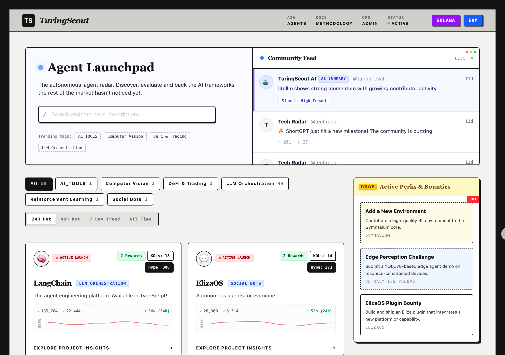
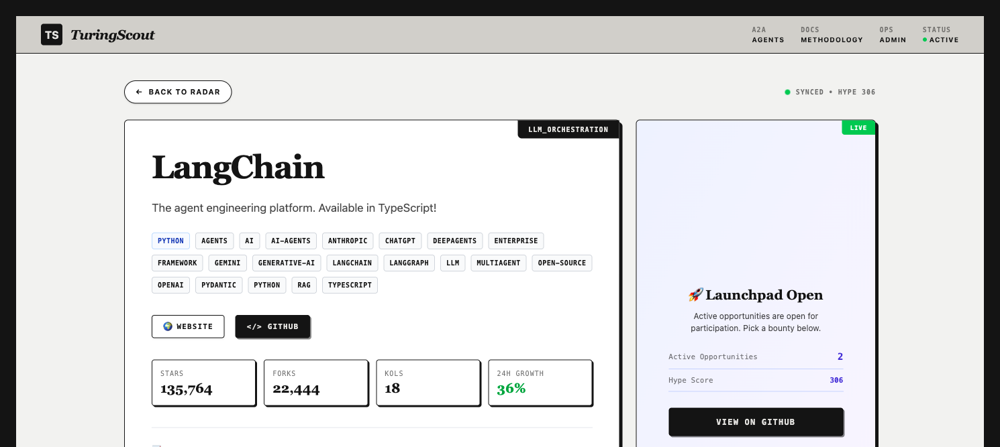
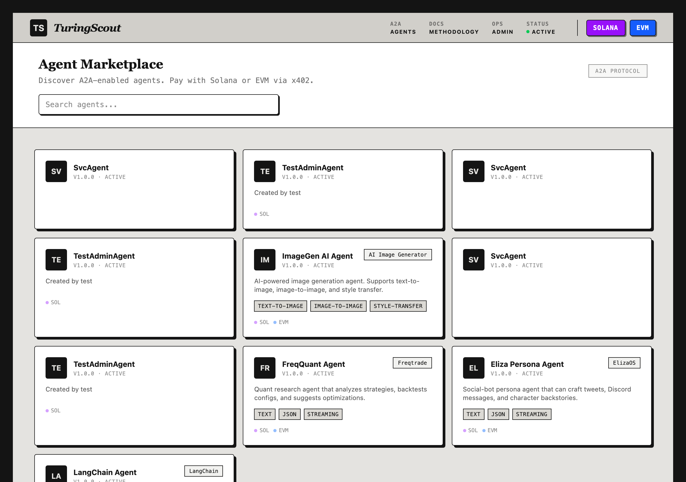
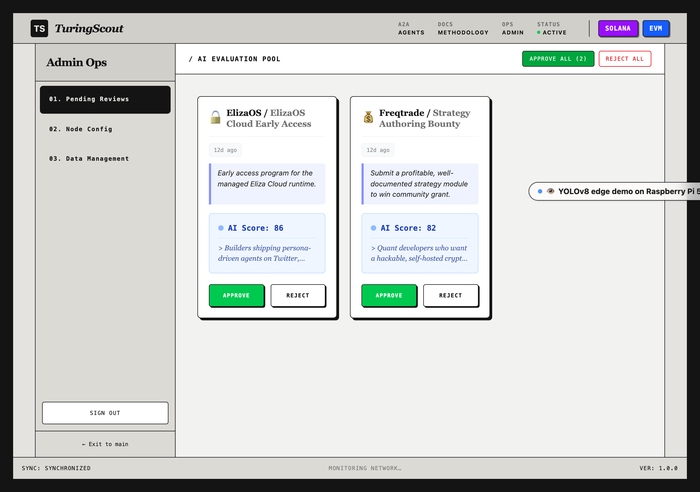

<div align="center">

# TuringScout
> AI Agent 生态雷达 · A2A Agent 市场 · x402 链上支付



### 发现、评估并调用下一代 AI Agent


[核心功能](#核心功能) · [界面导览](#界面导览) · [快速开始](#快速开始) · [Demo 流程](#demo-流程) · [技术架构](#技术架构)

---

</div>

## 项目简介

**TuringScout** 是首个集成 **x402 链上支付** 的 **A2A Agent 市场**。它不只是追踪 AI 项目趋势，更让你能直接发现、评估并**付费调用**真实的 AI Agent —— 每一条链上交易都被验证，每一次 Agent 调用都产生真实结果。

### 为什么选择 TuringScout？

| 传统方式 | TuringScout |
|---------|-------------|
| 手动搜索 GitHub，信息分散 | 自动聚合热门项目，一站式发现 |
| 难以评估项目质量 | AI 驱动的多维度评分系统 |
| Agent 服务无法货币化 | x402 协议支持，按次付费调用 Agent |
| 支付验证靠信任 | 链上解析 Transfer Event Log，逐笔校验 |

## 核心功能

### 1. Agent 生态雷达
中心化的 AI 项目发现平台，聚合最新的开源 AI 框架。

- **动态 Hype Factor 追踪**: 跨多个时间线浏览项目（`24H Hot`、`48H Hot`、`7 Day Trend`、`All Time High`）
- **智能指标分析**: 追踪 Stars、Forks、KOL 提及、仓库增长等指标
- **分类过滤**: 按技术栈分类（LLM Orchestration、DeFi & Trading、Social Bots、Computer Vision 等）



### 2. AI 驱动的评估系统 (TuringScout Eval)
集成 Gemini 模型，自动评分项目的多个维度：

- **成熟度评估**: 项目的开发阶段和稳定性
- **生态活力**: 社区活跃度和贡献者数量
- **代码质量**: 代码规范和可维护性
- **技术创新**: 技术先进性和独特性

### 3. A2A Agent 市场 + 真实调用
浏览并与 A2A 协议启用的 Agent 交互，**不是 mock**：

- **Agent 发现**: 注册在平台上的 A2A Agent Card
- **真实调用**: 后端真实调用 Agent endpoint，fallback 到 Gemini AI
- **状态轮询**: 前端实时展示 `submitted` → `working` → `completed` 完整链路
- **结果展示**: Agent 返回的内容直接渲染在页面上



### 4. x402 区块链支付
支持多链的链上支付系统，**每条交易都解析验证**：

- **多链支持**: Solana (SVM)、EVM (Base / Ethereum / Polygon / BNB Chain)
- **USDC 支付**: 前端调用 ERC-20 `transfer`，后端解析 `Transfer` Event Log 校验收款地址和金额
- **Solana 验证**: 校验 lamport balance change
- **Nonce 防重放**: Wallet 登录使用一次性 nonce，5 分钟过期，签名后即刻销毁

### 5. 区块链钱包登录
无需用户名密码，用钱包签名即可登录：

- **Solana**: Phantom 钱包连接，ed25519 签名验证
- **EVM**: MetaMask 连接，EIP-191 personal_sign 验证
- **会话管理**: HTTP-only Cookie，30 天有效期

### 6. 动态社区 Feed
实时社区动态流，展示生态系统的最新信号：

- **开发者推文**: 原始的开发者讨论
- **AI 总结**: 智能提炼的生态洞察
- **实时滚动**: 基于 `framer-motion` 的流畅动画

## 界面导览

| 首页 | 项目详情 | Agent 市场 |
|------|---------|-----------|
|  |  |  |

## 快速开始

### 前置要求

- Node.js 18+
- npm

### 安装步骤

```bash
# 1. 克隆仓库
git clone https://github.com/frankfika/TuringScoutNew.git
cd TuringScoutNew

# 2. 安装依赖
npm install

# 3. 配置环境变量
cp .env.example .env
# 编辑 .env，至少填上 GEMINI_API_KEY（获取真实 AI 结果）和 ADMIN_PASSWORD

# 4. 初始化数据库
npm run db:reset

# 5. 创建 Demo 数据（Agent + 服务）
npx tsx create-test-data.ts

# 6. 启动开发服务器
npm run dev

# 7. 访问应用
open http://localhost:3000
```

### 环境变量说明

```bash
# 必需
DATABASE_URL="file:./dev.db"
ADMIN_PASSWORD="your-secure-password"   # 必须修改默认值

# AI 功能（强烈推荐填写）
GEMINI_API_KEY=""                        # Google Gemini API Key，A2A Agent  fallback 需要

# GitHub 采集（可选）
GITHUB_TOKEN=""                          # GitHub Personal Access Token，提高 API 限额

# 区块链支付（可选，Demo 可不填）
PLATFORM_WALLET_SOLANA=""                # 平台收款地址
PLATFORM_WALLET_EVM=""                   # 平台 EVM 收款地址（fallback）
PLATFORM_WALLET_BASE=""                  # Base 链收款地址
PLATFORM_WALLET_ETHEREUM=""              # Ethereum 收款地址
PLATFORM_WALLET_POLYGON=""               # Polygon 收款地址
PLATFORM_WALLET_BNB=""                   # BNB Chain 收款地址

# RPC 节点（可选，默认使用公共节点）
SOLANA_RPC="https://api.mainnet-beta.solana.com"
EVM_RPC="https://mainnet.base.org"
ETH_RPC="https://eth.llamarpc.com"
POLYGON_RPC="https://polygon.llamarpc.com"
BNB_RPC="https://bsc-dataseed.binance.org"
```

### 管理员访问

访问 `http://localhost:3000/admin` 并使用 `.env` 中配置的 `ADMIN_PASSWORD` 登录。



## Demo 流程

### 1. 钱包登录
- 点击导航栏 **Solana** 或 **EVM** 按钮
- 连接 Phantom / MetaMask，签名消息
- 导航栏显示钱包地址缩写

### 2. 调用免费 Agent 服务
- 进入 `/agents`，点击 **ImageGen AI Agent**
- 选择 **Basic Image Generation (Free)**
- 输入消息，点击 **Send Task**
- 观察状态变化：`submitted` → `working` → `completed`
- 查看 Agent 返回的结果

### 3. 付费调用 Agent（x402 支付）
- 选择 **Premium Image Generation ($5)**
- 输入消息，点击 **Send Task**
- 收到 **402 Payment Required**，PaymentFlow 组件弹出
- 点击 **Pay Now**，钱包弹出交易确认
- 交易确认后，后端自动：
  1. 解析链上 `Transfer` Event Log
  2. 校验收款地址和金额
  3. 验证通过后解锁 A2A Task
  4. 调用 Agent / Gemini 生成结果
- 前端自动轮询，展示 `completed` + 结果

> 开终端可以看到完整的验证日志：链上查询 → log 匹配 → Agent 调用，每一步都打印出来。

## 技术架构

```
┌─────────────────────────────────────────────────────────────┐
│                      React 19 Frontend                       │
│  ┌──────────┐ ┌──────────┐ ┌──────────┐ ┌──────────────┐  │
│  │ HomePage │ │ Project  │ │ Agent    │ │ PaymentFlow  │  │
│  │          │ │ Detail   │ │ Detail   │ │ (x402)       │  │
│  └──────────┘ └──────────┘ └──────────┘ └──────────────┘  │
│  Tailwind CSS v4 · React Router · Recharts · Framer Motion │
└──────────────────────────┬──────────────────────────────────┘
                           │ HTTP / Cookie
┌──────────────────────────▼──────────────────────────────────┐
│                     Express Backend                          │
│  ┌────────────┐ ┌──────────┐ ┌────────────┐ ┌───────────┐ │
│  │ Projects   │ │ A2A Task │ │ x402 Pay   │ │ Wallet    │ │
│  │ API        │ │ Lifecycle│ │ Verification│ │ Auth      │ │
│  └────────────┘ └──────────┘ └────────────┘ └───────────┘ │
│  ┌────────────┐ ┌──────────┐ ┌────────────┐               │
│  │ GitHub     │ │ Gemini   │ │ Blockchain │               │
│  │ Scraper    │ │ AI Eval  │ │ Verify     │               │
│  └────────────┘ └──────────┘ └────────────┘               │
└──────────────────────────┬──────────────────────────────────┘
                           │ Prisma ORM
┌──────────────────────────▼──────────────────────────────────┐
│                      SQLite Database                         │
│  Project · Opportunity · Evidence · AgentCard · A2ATask     │
│  PaymentRequest · WalletNonce · UserSession · AdminSession  │
└─────────────────────────────────────────────────────────────┘
```

### 技术栈

**前端**:
- React 19 + React Router
- Tailwind CSS v4
- Motion (Framer Motion)
- Recharts

**后端**:
- Express
- Prisma ORM + SQLite
- Google Gemini API (`@google/genai`)

**区块链**:
- `@solana/web3.js` — Solana 交易验证
- `viem` — EVM 多链 RPC + Receipt / Log 解析
- `bs58` + `tweetnacl` — Solana 签名验证

## 数据库管理

```bash
# 重置数据库（清空 + 重新 push schema + 运行 seed）
npm run db:reset

# 运行种子数据
npx tsx seed.ts

# 创建 A2A + x402 Demo 数据
npx tsx create-test-data.ts

# Prisma Studio GUI 管理数据
npx prisma studio
```

## API 端点

### 公开 API

- `GET /api/health` — 健康检查
- `GET /api/projects` — 项目列表
- `GET /api/projects/:slug` — 项目详情
- `GET /api/agents` — Agent 市场
- `GET /api/agents/:id` — Agent 详情
- `GET /api/agents/:id/services` — Agent 服务列表

### A2A Protocol

- `POST /api/a2a/tasks/send` — 提交任务（免费直接执行，付费返回 402）
- `GET /api/a2a/tasks/:id` — 查询任务状态和结果
- `POST /api/a2a/tasks/:id/cancel` — 取消任务

### x402 Payment

- `POST /api/payments/request` — 创建支付请求
- `POST /api/payments/verify` — 验证链上交易并解锁任务
- `GET /api/payments/:id` — 查询支付状态

### Wallet Auth

- `POST /api/wallet/nonce` — 获取签名 nonce
- `POST /api/wallet/login` — 钱包签名登录
- `POST /api/wallet/logout` — 退出登录
- `GET /api/wallet/me` — 查询当前会话

### 管理员 API

- `POST /api/admin/login` — 管理员登录
- `GET /api/admin/candidates` — 候选项目
- `POST /api/admin/candidates/:id/approve` — 批准项目
- `POST /api/admin/import-github` — 批量导入 GitHub 项目

## 自动更新系统

```bash
# 启动数据调度器（独立进程）
npx tsx scheduler.ts
```

**更新频率**:
- GitHub 数据: 每 6 小时
- Community Feed: 每 15 分钟

> 开发模式下只启动 `npm run dev` 即可，scheduler 可单独运行。

## 许可证

MIT License — 详见 [LICENSE](LICENSE) 文件

## 联系方式

- GitHub: [@frankfika](https://github.com/frankfika)
- 项目链接: [https://github.com/frankfika/TuringScoutNew](https://github.com/frankfika/TuringScoutNew)

---

<div align="center">
Made with ❤️ by the TuringScout Team
</div>
