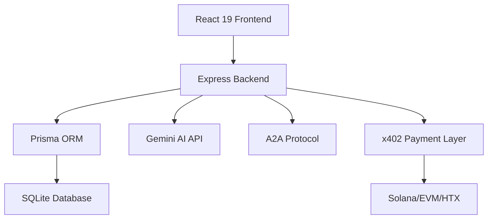

<div align="center">

# TuringScout
> AI 自主 Agent 生态系统雷达 · Autonomous Agent Ecosystem Radar


### 发现、评估并支持下一代 AI Agent 框架


[核心功能](#-核心功能) • [界面导览](#-界面导览) • [快速开始](#-快速开始) • [技术架构](#-技术架构)

__简体中文__ | [English](./README_EN.md)

---
</div>

## 项目简介

**TuringScout** 是你的 AI 自主 Agent 生态系统雷达，类似 AI 行业的 "CookieDAO"。它聚合来自 GitHub 仓库、社交情绪和开发者社区的信号，帮助你发现、评估并启动下一代 AI 和自主 Agent 框架。

### 为什么选择 TuringScout？

| 传统方式 | TuringScout |
|---------|-------------|
| 手动搜索 GitHub，信息分散 | 自动聚合热门项目，一站式发现 |
| 难以评估项目质量 | AI 驱动的多维度评分系统 |
| 错过早期机会 | 实时追踪趋势，提前发现潜力项目 |
| 缺乏社区洞察 | 动态社区 Feed，AI 总结生态信号 |

## 核心功能

### 1. 🚀 Agent Launchpad & Radar
中心化的 AI 项目发现平台，聚合最新的开源 AI 框架。

- **动态 Hype Factor 追踪**: 跨多个时间线浏览项目（`24H Hot`、`48H Hot`、`7 Day Trend`、`All Time High`）
- **智能指标分析**: 追踪 Stars、Forks、KOL 提及、仓库增长等指标
- **分类过滤**: 按技术栈分类（LLM Orchestration、DeFi & Trading、Social Bots、Computer Vision 等）


### 2. 🤖 AI 驱动的评估系统 (TuringScout Eval)
集成 Gemini 模型，自动评分项目的多个维度：

- **成熟度评估**: 项目的开发阶段和稳定性
- **生态活力**: 社区活跃度和贡献者数量
- **代码质量**: 代码规范和可维护性
- **技术创新**: 技术先进性和独特性

### 3. 📡 动态社区 Feed
实时社区动态流，展示生态系统的最新信号：

- **开发者推文**: 原始的开发者讨论
- **AI 总结**: 智能提炼的生态洞察
- **实时滚动**: 基于 `framer-motion` 的流畅动画
- **可操作洞察**: 直接链接到相关项目和机会

### 4. 💎 机会与赏金 (Perks & Leaks)
连接开发者与项目的早期机会：

- **Bounty 发布**: 项目方发布的开发任务
- **Hackathon 信息**: 最新的黑客松活动
- **贡献机会**: 开源项目的贡献指南
- **一键参与**: 直接从仪表板参与机会

### 5. 🤝 A2A Agent 市场
浏览并与 A2A 协议启用的 Agent 交互：

- **Agent 发现**: 注册在平台上的 A2A Agent
- **能力展示**: Agent 通过 Google A2A Protocol 暴露的能力
- **直接调用**: 从 UI 直接调用 Agent 服务


### 6. 💰 x402 区块链支付
支持多链的链上支付系统：

- **多链支持**: Solana (SVM)、EVM (Base)、HTX (Huobi Chain)
- **USDC 支付**: 使用 USDC 支付 Agent 服务
- **自动验证**: 链上交易自动验证
- **x402 协议**: 基于 x402 协议的支付流程

### 7. 📊 实时市场 Ticker
应用顶部的连续实时市场行情：

- **最新动态**: Agent 生态系统的突发新闻
- **热度追踪**: 实时的项目热度变化
- **无缝滚动**: 流畅的动画效果

## 界面导览

| 首页 | 项目详情 | Agent 市场 |
|------|---------|-----------|
|  |  |  |

## 技术架构



### 技术栈

**前端**:
- React 19 + React Router
- Tailwind CSS v4
- Motion (Framer Motion) - 流畅动画
- Recharts - 动态图表

**后端**:
- Express - API 服务器
- Prisma ORM - 数据库访问
- SQLite - 数据存储

**AI 集成**:
- `@google/genai` (Gemini API) - AI 评估和数据处理

**区块链**:
- `@solana/web3.js` - Solana 集成
- `viem` - EVM 集成
- x402 协议 - 支付验证

## 快速开始

### 前置要求

- Node.js 18+
- npm 或 yarn

### 安装步骤

1. **克隆仓库**
```bash
git clone https://github.com/frankfika/TuringScoutNew.git
cd TuringScoutNew
```

2. **安装依赖**
```bash
npm install
```

3. **配置环境变量**
```bash
cp .env.example .env
# 编辑 .env 文件，添加必要的配置
```

4. **初始化数据库**
```bash
npm run db:reset
```

5. **启动开发服务器**
```bash
npm run dev
```

6. **访问应用**
打开浏览器访问 `http://localhost:3000`

### 管理员访问

访问 `http://localhost:3000/admin` 并使用配置的管理员密码登录。


## 数据库管理

### 重置数据库
```bash
npm run db:reset
```

### 运行种子数据
```bash
npx tsx seed.ts
```

### Prisma Studio
```bash
npx prisma studio
```

## API 端点

### 公开 API

- `GET /api/health` - 健康检查
- `GET /api/projects` - 获取项目列表
- `GET /api/projects/:slug` - 获取项目详情
- `GET /api/opportunities` - 获取机会列表
- `GET /api/community-feed` - 获取社区动态
- `GET /api/ticker` - 获取实时 Ticker

### A2A Protocol

- `GET /api/a2a/discovery` - Agent 发现
- `POST /api/a2a/services/:agentId/submit` - 提交任务
- `GET /api/a2a/services/:agentId/artifacts/:artifactId` - 获取结果

### 管理员 API

- `POST /api/admin/login` - 管理员登录
- `GET /api/admin/candidates` - 获取候选项目
- `POST /api/admin/candidates/:id/approve` - 批准项目
- `POST /api/admin/import-github` - 批量导入 GitHub 项目

## 自动更新系统

TuringScout 包含自动更新调度器，定期更新项目数据：

```bash
npx tsx scheduler.ts
```

**更新频率**:
- GitHub 数据: 每 6 小时
- Community Feed: 每 15 分钟

## 测试

运行测试套件：
```bash
npm test
```

测试覆盖：
- API 端点测试
- A2A 协议测试
- 区块链支付测试
- 管理员功能测试

## 贡献指南

欢迎贡献！请遵循以下步骤：

1. Fork 本仓库
2. 创建特性分支 (`git checkout -b feature/AmazingFeature`)
3. 提交更改 (`git commit -m 'Add some AmazingFeature'`)
4. 推送到分支 (`git push origin feature/AmazingFeature`)
5. 开启 Pull Request

## 路线图

- [ ] 支持更多区块链网络
- [ ] 增强 AI 评估模型
- [ ] 移动端应用
- [ ] 社区投票功能
- [ ] 项目对比工具

## 许可证

MIT License - 详见 [LICENSE](LICENSE) 文件

## 联系方式

- GitHub: [@frankfika](https://github.com/frankfika)
- 项目链接: [https://github.com/frankfika/TuringScoutNew](https://github.com/frankfika/TuringScoutNew)

---

<div align="center">
Made with ❤️ by the TuringScout Team
</div>
