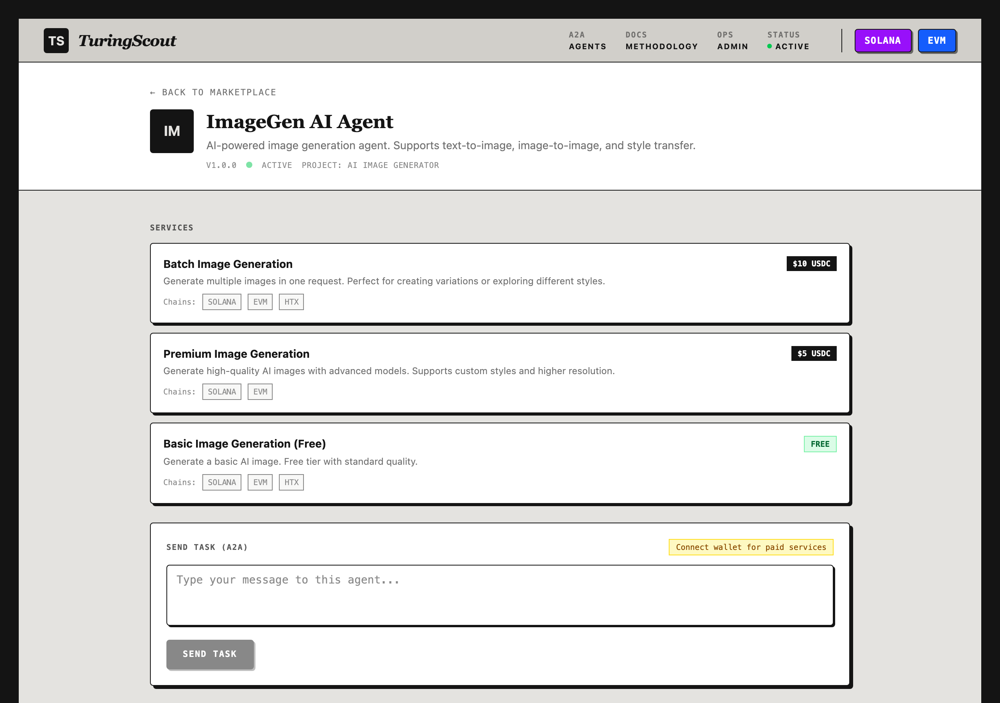
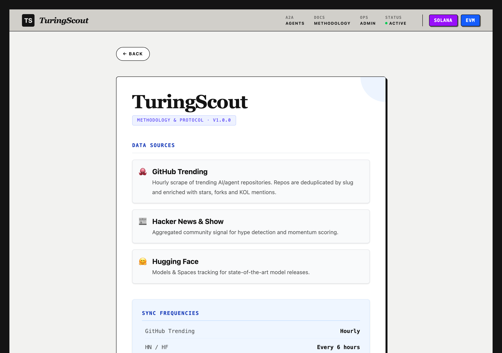

<div align="center">

# TuringScout
> AI Agent Ecosystem Radar · A2A Agent Marketplace · x402 On-Chain Payment


### Discover, Evaluate, and Invoke Next-Gen AI Agents


[Core Features](#core-features) · [UI Tour](#ui-tour) · [Quick Start](#quick-start) · [Demo Flow](#demo-flow) · [Architecture](#architecture)

[简体中文](./README.md) | __English__

---

</div>

## Project Overview

**TuringScout** is the first **A2A Agent Marketplace** integrated with **x402 on-chain payment**. It goes beyond tracking AI project trends — it enables you to discover, evaluate, and **pay-per-use** invoke real AI Agents. Every on-chain transaction is verified, and every Agent invocation produces real results.

### Why TuringScout?

| Traditional Way | TuringScout |
|----------------|-------------|
| Manually search GitHub, scattered info | Auto-aggregate trending projects, one-stop discovery |
| Hard to evaluate project quality | AI-powered multi-dimensional scoring system |
| Agent services cannot monetize | x402 protocol support, pay-per-call |
| Payment verification relies on trust | On-chain Transfer Event Log parsing, verified per transaction |

## Core Features

### 1. Agent Ecosystem Radar
Centralized AI project discovery platform, aggregating the latest open-source AI frameworks.

- **Dynamic Hype Factor Tracking**: Browse projects across multiple timelines (`24H Hot`, `48H Hot`, `7 Day Trend`, `All Time High`)
- **Smart Metrics Analysis**: Track Stars, Forks, KOL mentions, repo growth, and more
- **Category Filtering**: Filter by tech stack (LLM Orchestration, DeFi & Trading, Social Bots, Computer Vision, etc.)


### 2. AI-Powered Evaluation System (TuringScout Eval)
Integrated with Gemini model, automatically scores projects across multiple dimensions:

- **Maturity Assessment**: Project development stage and stability
- **Ecosystem Vitality**: Community activity and contributor count
- **Code Quality**: Code standards and maintainability
- **Tech Innovation**: Technical advancement and uniqueness

### 3. A2A Agent Marketplace + Real Invocation
Browse and interact with A2A protocol-enabled Agents — **not mock**:

- **Agent Discovery**: A2A Agent Cards registered on the platform
- **Real Invocation**: Backend truly calls Agent endpoint, with fallback to Gemini AI
- **Status Polling**: Frontend displays the complete lifecycle `submitted` → `working` → `completed`
- **Result Display**: Agent-returned content rendered directly on the page


### 4. x402 Blockchain Payment
Multi-chain on-chain payment system, **every transaction is parsed and verified**:

- **Multi-chain Support**: Solana (SVM), EVM (Base / Ethereum / Polygon / BNB Chain)
- **USDC Payment**: Frontend calls ERC-20 `transfer`, backend parses `Transfer` Event Log to verify payee address and amount
- **Solana Verification**: Verify lamport balance change
- **Nonce Replay Protection**: Wallet login uses one-time nonce, expires in 5 minutes, destroyed immediately after signature



### 5. Blockchain Wallet Login
No username/password needed — login with wallet signature:

- **Solana**: Phantom wallet connection, ed25519 signature verification
- **EVM**: MetaMask connection, EIP-191 personal_sign verification
- **Session Management**: HTTP-only Cookie, 30-day validity

### 6. Dynamic Community Feed
Real-time community activity stream, showcasing the latest signals from the ecosystem:

- **Developer Tweets**: Raw developer discussions
- **AI Summary**: Intelligent distilled ecosystem insights
- **Real-time Scroll**: Smooth animations powered by `framer-motion`

## UI Tour

| Home | Project Detail | Agent Marketplace |
|------|---------------|-------------------|
|  |  |  |

| Agent Detail | Methodology | Admin Dashboard |
|-----------|--------|---------|
|  |  |  |

## Quick Start

### Prerequisites

- Node.js 18+
- npm

### Installation

```bash
# 1. Clone the repo
git clone https://github.com/frankfika/TuringScoutNew.git
cd TuringScoutNew

# 2. Install dependencies
npm install

# 3. Configure environment variables
cp .env.example .env
# Edit .env, fill in at least GEMINI_API_KEY (for real AI results) and ADMIN_PASSWORD

# 4. Initialize database
npm run db:reset

# 5. Create Demo data (Agent + Services)
npx tsx create-test-data.ts

# 6. Start dev server
npm run dev

# 7. Open the app
open http://localhost:3000
```

### Environment Variables

```bash
# Required
DATABASE_URL="file:./dev.db"
ADMIN_PASSWORD="your-secure-password"   # Must change default

# AI (strongly recommended)
GEMINI_API_KEY=""                        # Google Gemini API Key, required for A2A Agent fallback

# GitHub scraping (optional)
GITHUB_TOKEN=""                          # GitHub Personal Access Token, increases API rate limit

# Blockchain payment (optional, Demo works without)
PLATFORM_WALLET_SOLANA=""                # Platform Solana payee address
PLATFORM_WALLET_EVM=""                   # Platform EVM payee address (fallback)
PLATFORM_WALLET_BASE=""                  # Base chain payee address
PLATFORM_WALLET_ETHEREUM=""              # Ethereum payee address
PLATFORM_WALLET_POLYGON=""               # Polygon payee address
PLATFORM_WALLET_BNB=""                   # BNB Chain payee address

# RPC nodes (optional, defaults to public nodes)
SOLANA_RPC="https://api.mainnet-beta.solana.com"
EVM_RPC="https://mainnet.base.org"
ETH_RPC="https://eth.llamarpc.com"
POLYGON_RPC="https://polygon.llamarpc.com"
BNB_RPC="https://bsc-dataseed.binance.org"
```

### Admin Access

Visit `http://localhost:3000/admin` and log in with `ADMIN_PASSWORD` from `.env`.

## Demo Flow

### 1. Wallet Login
- Click **Solana** or **EVM** button in the nav bar
- Connect Phantom / MetaMask, sign the message
- Nav bar displays abbreviated wallet address

### 2. Invoke Free Agent Service
- Go to `/agents`, click **ImageGen AI Agent**
- Select **Basic Image Generation (Free)**
- Type a message, click **Send Task**
- Watch status change: `submitted` → `working` → `completed`
- View the result returned by the Agent

### 3. Paid Agent Invocation (x402 Payment)
- Select **Premium Image Generation ($5)**
- Type a message, click **Send Task**
- Receive **402 Payment Required**, PaymentFlow component pops up
- Click **Pay Now**, wallet opens transaction confirmation
- After transaction confirms, backend automatically:
  1. Parses on-chain `Transfer` Event Log
  2. Verifies payee address and amount
  3. Unlocks A2A Task after verification passes
  4. Invokes Agent / Gemini to generate result
- Frontend auto-polls, displays `completed` + result

> Open your terminal to see the full verification logs: on-chain query → log matching → Agent invocation, every step is printed.

## Architecture

```
┌─────────────────────────────────────────────────────────────┐
│                      React 19 Frontend                       │
│  ┌──────────┐ ┌──────────┐ ┌──────────┐ ┌──────────────┐  │
│  │ HomePage │ │ Project  │ │ Agent    │ │ PaymentFlow  │  │
│  │          │ │ Detail   │ │ Detail   │ │ (x402)       │  │
│  └──────────┘ └──────────┘ └──────────┘ └──────────────┘  │
│  Tailwind CSS v4 · React Router · Recharts · Framer Motion │
└──────────────────────────┬──────────────────────────────────┘
                           │ HTTP / Cookie
┌──────────────────────────▼──────────────────────────────────┐
│                     Express Backend                          │
│  ┌────────────┐ ┌──────────┐ ┌────────────┐ ┌───────────┐ │
│  │ Projects   │ │ A2A Task │ │ x402 Pay   │ │ Wallet    │ │
│  │ API        │ │ Lifecycle│ │ Verification│ │ Auth      │ │
│  └────────────┘ └──────────┘ └────────────┘ └───────────┘ │
│  ┌────────────┐ ┌──────────┐ ┌────────────┐               │
│  │ GitHub     │ │ Gemini   │ │ Blockchain │               │
│  │ Scraper    │ │ AI Eval  │ │ Verify     │               │
│  └────────────┘ └──────────┘ └────────────┘               │
└──────────────────────────┬──────────────────────────────────┘
                           │ Prisma ORM
┌──────────────────────────▼──────────────────────────────────┐
│                      SQLite Database                         │
│  Project · Opportunity · Evidence · AgentCard · A2ATask     │
│  PaymentRequest · WalletNonce · UserSession · AdminSession  │
└─────────────────────────────────────────────────────────────┘
```

### Tech Stack

**Frontend**:
- React 19 + React Router
- Tailwind CSS v4
- Motion (Framer Motion)
- Recharts

**Backend**:
- Express
- Prisma ORM + SQLite
- Google Gemini API (`@google/genai`)

**Blockchain**:
- `@solana/web3.js` — Solana transaction verification
- `viem` — EVM multi-chain RPC + Receipt / Log parsing
- `bs58` + `tweetnacl` — Solana signature verification

## Database Management

```bash
# Reset database (drop + push schema + seed)
npm run db:reset

# Run seed
npx tsx seed.ts

# Create A2A + x402 Demo data
npx tsx create-test-data.ts

# Prisma Studio GUI
npx prisma studio
```

## API Endpoints

### Public API

- `GET /api/health` — Health check
- `GET /api/projects` — Project list
- `GET /api/projects/:slug` — Project detail
- `GET /api/agents` — Agent marketplace
- `GET /api/agents/:id` — Agent detail
- `GET /api/agents/:id/services` — Agent services list

### A2A Protocol

- `POST /api/a2a/tasks/send` — Submit task (free tasks execute directly, paid return 402)
- `GET /api/a2a/tasks/:id` — Query task status and result
- `POST /api/a2a/tasks/:id/cancel` — Cancel task

### x402 Payment

- `POST /api/payments/request` — Create payment request
- `POST /api/payments/verify` — Verify on-chain transaction and unlock task
- `GET /api/payments/:id` — Query payment status

### Wallet Auth

- `POST /api/wallet/nonce` — Get signing nonce
- `POST /api/wallet/login` — Wallet signature login
- `POST /api/wallet/logout` — Logout
- `GET /api/wallet/me` — Query current session

### Admin API

- `POST /api/admin/login` — Admin login
- `GET /api/admin/candidates` — Candidate projects
- `POST /api/admin/candidates/:id/approve` — Approve project
- `POST /api/admin/import-github` — Bulk import GitHub projects

## Auto Update System

```bash
# Start data scheduler (standalone process)
npx tsx scheduler.ts
```

**Update Frequency**:
- GitHub Data: every 6 hours
- Community Feed: every 15 minutes

> In dev mode, just run `npm run dev`. The scheduler can run separately.

## Screenshot Generation

```bash
# 1. Make sure the app is running
npm run dev

# 2. Run screenshot script
node scripts/capture-screenshots.mjs

# Screenshots will be saved to docs/assets/
```

## License

MIT License — See [LICENSE](LICENSE) file for details

## Contact

- GitHub: [@frankfika](https://github.com/frankfika)
- Project Link: [https://github.com/frankfika/TuringScoutNew](https://github.com/frankfika/TuringScoutNew)

---

<div align="center">
Made with ❤️ by the TuringScout Team
</div>
