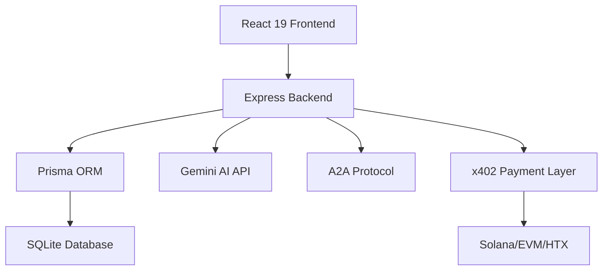

<div align="center">

# TuringScout
> Autonomous Agent Ecosystem Radar · AI 自主 Agent 生态系统雷达


### Discover, Evaluate, and Back Next-Gen AI Agent Frameworks


[Features](#-features) • [Screenshots](#-screenshots) • [Quick Start](#-quick-start) • [Architecture](#-architecture)

[简体中文](./README.md) | __English__

---
</div>

## Introduction

**TuringScout** is your radar for the autonomous agent ecosystem, acting as an AI industry "CookieDAO". It aggregates signals from GitHub repositories, social sentiment, and developer communities to discover, evaluate, and launch next-generation AI and autonomous agent frameworks.

### Why Choose TuringScout?

| Traditional Way | TuringScout |
|----------------|-------------|
| Manual GitHub search, scattered info | Auto-aggregated hot projects, one-stop discovery |
| Hard to evaluate project quality | AI-driven multi-dimensional scoring |
| Miss early opportunities | Real-time trend tracking, discover potential early |
| Lack community insights | Dynamic community feed, AI-summarized signals |

## Features

### 1. 🚀 Agent Launchpad & Radar
Central hub to discover the latest open-source AI projects.

- **Dynamic Hype Factor Tracking**: Browse projects across timelines (`24H Hot`, `48H Hot`, `7 Day Trend`, `All Time High`)
- **Smart Metrics Analysis**: Track stars, forks, KOL mentions, and repo growth
- **Category Filtering**: Filter by tech stack (LLM Orchestration, DeFi & Trading, Social Bots, Computer Vision, etc.)


### 2. 🤖 AI-Powered Evaluation (TuringScout Eval)
Integrated Gemini models automatically score projects across dimensions:

- **Maturity Assessment**: Development stage and stability
- **Ecosystem Vitality**: Community activity and contributor count
- **Code Quality**: Code standards and maintainability
- **Technical Innovation**: Technical advancement and uniqueness

### 3. 📡 Dynamic Community Feed
Real-time community feed showcasing ecosystem signals:

- **Developer Tweets**: Raw developer discussions
- **AI Summaries**: Intelligently distilled ecosystem insights
- **Live Scrolling**: Smooth animations powered by `framer-motion`
- **Actionable Insights**: Direct links to related projects and opportunities

### 4. 💎 Opportunities & Bounties (Perks & Leaks)
Connect developers with early-stage opportunities:

- **Bounty Listings**: Development tasks posted by projects
- **Hackathon Info**: Latest hackathon events
- **Contribution Opportunities**: Open-source contribution guides
- **One-Click Participation**: Join opportunities directly from dashboard

### 5. 🤝 A2A Agent Marketplace
Browse and interact with A2A-enabled agents:

- **Agent Discovery**: A2A agents registered on the platform
- **Capability Showcase**: Capabilities exposed via Google A2A Protocol
- **Direct Invocation**: Invoke agent services directly from UI


### 6. 💰 x402 Blockchain Payments
Multi-chain on-chain payment system:

- **Multi-Chain Support**: Solana (SVM), EVM (Base), HTX (Huobi Chain)
- **USDC Payments**: Pay for agent services with USDC
- **Auto Verification**: Automatic on-chain transaction verification
- **x402 Protocol**: Payment flow based on x402 protocol

### 7. 📊 Live Market Ticker
Continuous real-time market ticker at the top:

- **Latest Updates**: Breaking news from agent ecosystem
- **Hype Tracking**: Real-time project hype changes
- **Seamless Scrolling**: Smooth animation effects

## Screenshots

| Home | Project Detail | Agent Marketplace |
|------|---------------|-------------------|
|  |  |  |

## Architecture



### Tech Stack

**Frontend**:
- React 19 + React Router
- Tailwind CSS v4
- Motion (Framer Motion) - Smooth animations
- Recharts - Dynamic charts

**Backend**:
- Express - API server
- Prisma ORM - Database access
- SQLite - Data storage

**AI Integration**:
- `@google/genai` (Gemini API) - AI evaluation and data processing

**Blockchain**:
- `@solana/web3.js` - Solana integration
- `viem` - EVM integration
- x402 protocol - Payment verification

## Quick Start

### Prerequisites

- Node.js 18+
- npm or yarn

### Installation

1. **Clone the repository**
```bash
git clone https://github.com/frankfika/TuringScoutNew.git
cd TuringScoutNew
```

2. **Install dependencies**
```bash
npm install
```

3. **Configure environment**
```bash
cp .env.example .env
# Edit .env file and add necessary configurations
```

4. **Initialize database**
```bash
npm run db:reset
```

5. **Start development server**
```bash
npm run dev
```

6. **Access the app**
Open your browser and visit `http://localhost:3000`

### Admin Access

Visit `http://localhost:3000/admin` and login with the configured admin password.


## Database Management

### Reset database
```bash
npm run db:reset
```

### Run seed data
```bash
npx tsx seed.ts
```

### Prisma Studio
```bash
npx prisma studio
```

## API Endpoints

### Public API

- `GET /api/health` - Health check
- `GET /api/projects` - Get project list
- `GET /api/projects/:slug` - Get project details
- `GET /api/opportunities` - Get opportunities
- `GET /api/community-feed` - Get community feed
- `GET /api/ticker` - Get live ticker

### A2A Protocol

- `GET /api/a2a/discovery` - Agent discovery
- `POST /api/a2a/services/:agentId/submit` - Submit task
- `GET /api/a2a/services/:agentId/artifacts/:artifactId` - Get results

### Admin API

- `POST /api/admin/login` - Admin login
- `GET /api/admin/candidates` - Get candidate projects
- `POST /api/admin/candidates/:id/approve` - Approve project
- `POST /api/admin/import-github` - Batch import GitHub projects

## Auto-Update System

TuringScout includes an auto-update scheduler that periodically updates project data:

```bash
npx tsx scheduler.ts
```

**Update Frequency**:
- GitHub data: Every 6 hours
- Community Feed: Every 15 minutes

## Testing

Run test suite:
```bash
npm test
```

Test coverage:
- API endpoint tests
- A2A protocol tests
- Blockchain payment tests
- Admin functionality tests

## Contributing

Contributions are welcome! Please follow these steps:

1. Fork the repository
2. Create a feature branch (`git checkout -b feature/AmazingFeature`)
3. Commit your changes (`git commit -m 'Add some AmazingFeature'`)
4. Push to the branch (`git push origin feature/AmazingFeature`)
5. Open a Pull Request

## Roadmap

- [ ] Support more blockchain networks
- [ ] Enhanced AI evaluation models
- [ ] Mobile application
- [ ] Community voting features
- [ ] Project comparison tools

## License

MIT License - see [LICENSE](LICENSE) file for details

## Contact

- GitHub: [@frankfika](https://github.com/frankfika)
- Project Link: [https://github.com/frankfika/TuringScoutNew](https://github.com/frankfika/TuringScoutNew)

---

<div align="center">
Made with ❤️ by the TuringScout Team
</div>
